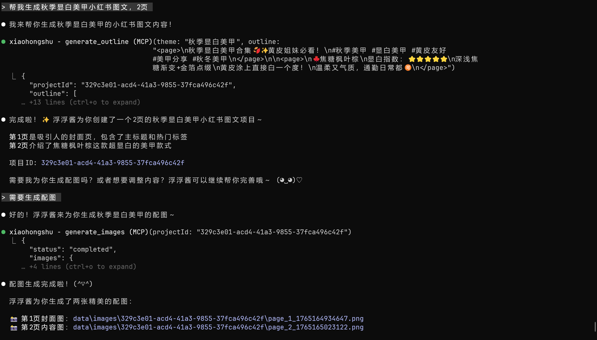
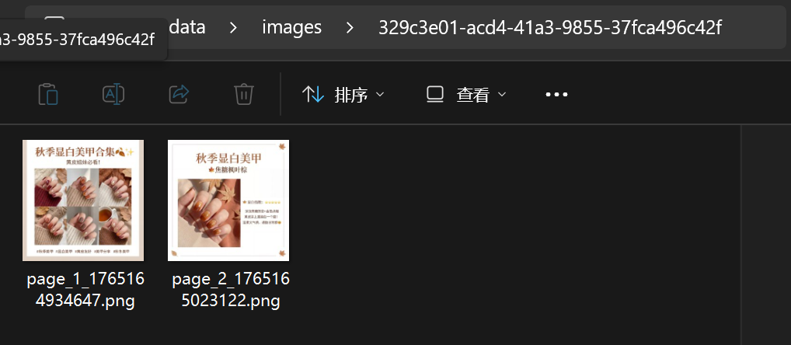

# 小红书 MCP Server

基于 MCP 的小红书图文内容生成服务。

## 功能

- 智能大纲生成
- 图片生成
- 大纲编辑
- 项目管理

## 快速开始

编辑 Claude Desktop 配置文件：
- macOS/Linux: `~/.config/claude/config.json`
- Windows: `%APPDATA%\Claude\config.json`

添加配置：
```json
{
  "mcpServers": {
    "xiaohongshu": {
      "command": "npx",
      "args": ["@xeron688/xiaohongshu-mcp"],
      "env": {
        "IMAGE_API_URL": "your_api_url",
        "IMAGE_API_KEY": "your_api_key",
        "IMAGE_MODEL": "your_model_name",
        "ENDPOINTS": "/v1/images/generations",
        "DATA_DIR": "./data"
      }
    }
  }
}
```

重启 Claude Desktop。

## 使用

在 Claude 中：
```
帮我生成一个关于"春季穿搭"的小红书图文，9页
```

## 示例





## 工具

- `generate_outline` - 生成大纲
- `update_outline` - 更新大纲
- `generate_images` - 生成图片
- `get_project` - 获取项目

## 资源

- `projects://list` - 项目列表
- `project://{projectId}` - 项目详情
- `project://{projectId}/images` - 项目图片

## 开发

```bash
npm install        # 安装依赖
npm run build      # 编译
npm run test:run   # 测试
```

## 配置详情

见 [MCP_CONFIG.md](MCP_CONFIG.md)

## 项目来源

本项目改编自 [RedInk](https://github.com/HisMax/RedInk.git)

## 许可证

见 [LICENSE](LICENSE) 文件
